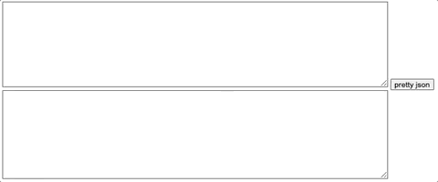

# Formatting json using Web Assembly with Go

This project is just to test how can we use Golang to compile wasm code into javascript on the browser.



## How it works

Run `$ make compile-wasm` to compile the Go code inside `./cmd/wasm/` folder. Also the `$ make run-server` can be used to run a Golang WebServer to render the HTML on `localhost:9090`.

You can paste a minified JSON like the one from the example bellow inside the text input and then press the **pretty json** button to convert it into a more readable JSON.

```json
{"website":"golangbot.com", "tutorials": {"string":"https://golangbot.com/strings/", "maps":"https://golangbot.com/maps/", "goroutine":"https://golangbot.com/goroutines/", "channels":"https://golangbot.com/channels/"}}
```

## Sources

[WebAssembly: Introduction to WebAssembly using Go](https://golangbot.com/webassembly-using-go/)
[WebAssembly: DOM Access and Error Handling](https://golangbot.com/go-webassembly-dom-access/)